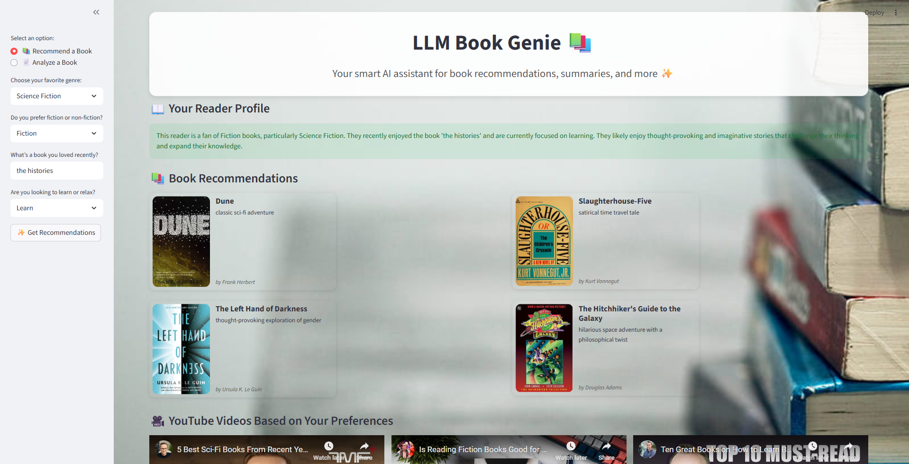
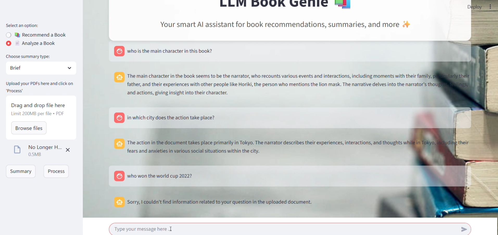

# LLM-Book-Recommender-and-Analysis

# 📚 LLM Book Genie

> Your intelligent AI assistant for book recommendations, personalized reading experiences, and document understanding.




---

## 🚀 Overview

**LLM Book Genie** is a powerful, interactive AI web application built with **Streamlit** and **LangChain**, combining the capabilities of **LLMs**, **Retrieval-Augmented Generation (RAG)**, and **embedding-based search** to:

- Recommend books based on user preferences
- Summarize uploaded PDF books or documents
- Provide conversational Q&A on the contents of uploaded PDFs

---

## 🧠 Key Features

### 📚 Book Recommendation System
- Personalized book suggestions based on:
  - Favorite genre
  - Fiction vs Non-fiction preference
  - Recently loved book
  - Reading goal (Learn or Relax)
- Automatically fetches **book covers**
- Adds relevant **YouTube video recommendations**

### 📄 Book & PDF Analyzer (RAG-powered)
- Upload any **PDF book or document**
- Choose between **brief or detailed summaries**
- Ask follow-up questions in a conversational format
- Combines **BM25 + OpenAI Embeddings + FAISS** for high-quality document search
- Uses **LangChain RAG chains** for intelligent responses

---

## 🛠️ Tech Stack

| Technology       | Role                                |
|------------------|-------------------------------------|
| **Python**       | Core programming language           |
| **Streamlit**    | Frontend + interactive UI           |
| **LangChain**    | RAG, chains, retrievers, LLM agents |
| **OpenAI API**   | Embeddings + LLM responses          |
| **FAISS**        | Vector search for PDF chunks        |
| **BM25**         | Keyword-based text retrieval        |
| **dotenv**       | Secure API key management           |
| **PyPDF2**       | Extracting text from PDF documents  |

---

## 📷 Screenshots

| Book Recommendations | PDF Q&A Chat |
|----------------------|---------------|
|  |  |

---

## 💡 How It Works

### 📚 Book Recommender Flow
1. User selects preferences from sidebar.
2. A prompt is generated and passed to the LLM to return book recommendations.
3. The app parses recommendations and dynamically fetches book covers and YouTube content.

### 📄 PDF Analysis (RAG Flow)
1. User uploads PDF and selects summary type.
2. PDF is split into text chunks and embedded with **OpenAI Embeddings**.
3. An **EnsembleRetriever** (BM25 + FAISS) retrieves relevant chunks.
4. A **LangChain RAG chain** uses the context and chat history to respond.

---

## 🔐 Setup & Installation

### 1. Clone the repository

```bash
git clone https://github.com/Hadicheayto/LLM-Book-Recommender-and-Analysis
cd llm-book-genie
